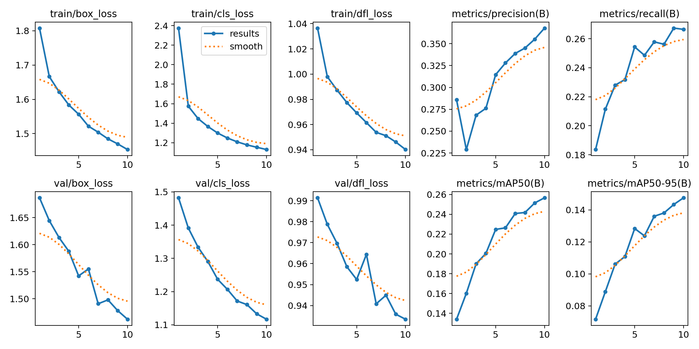
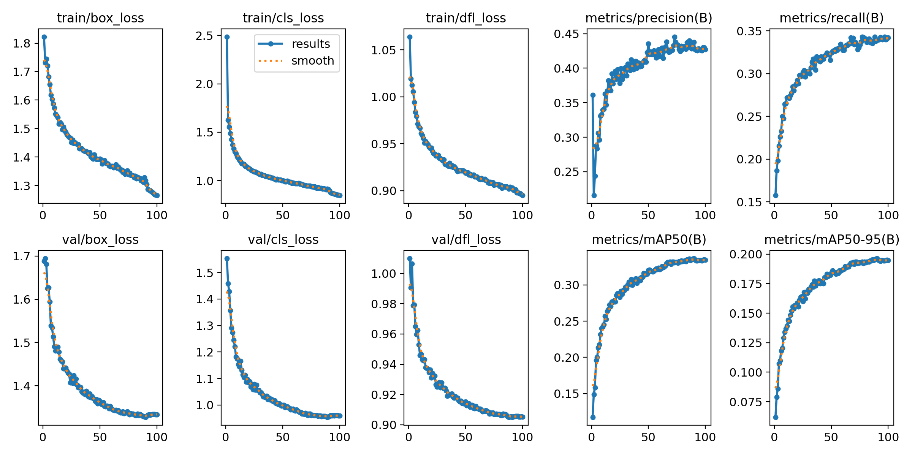
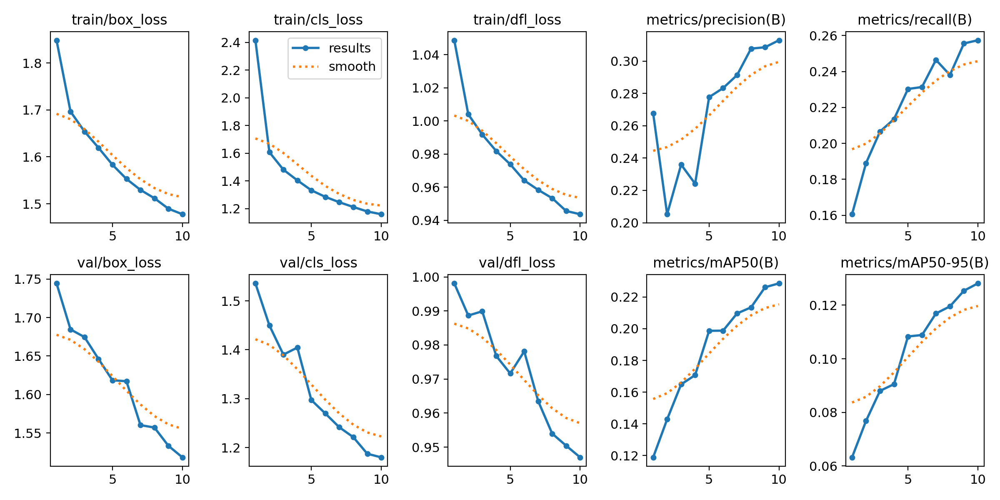
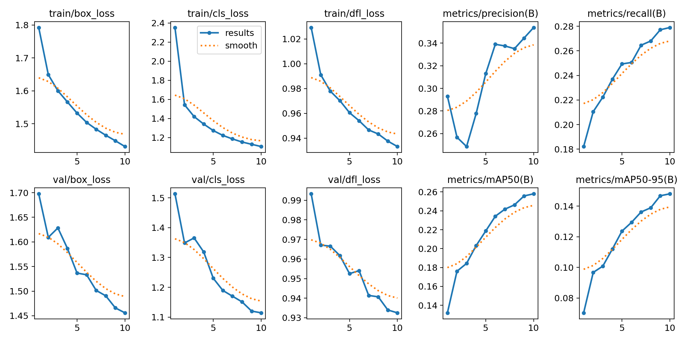
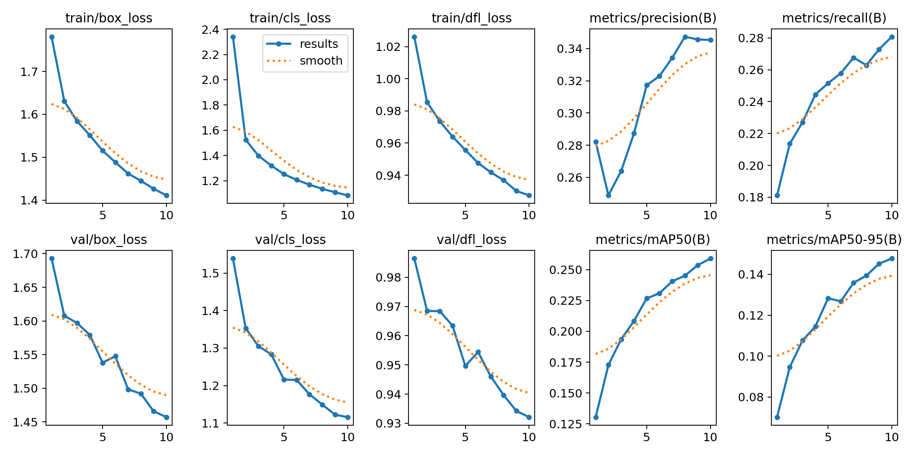
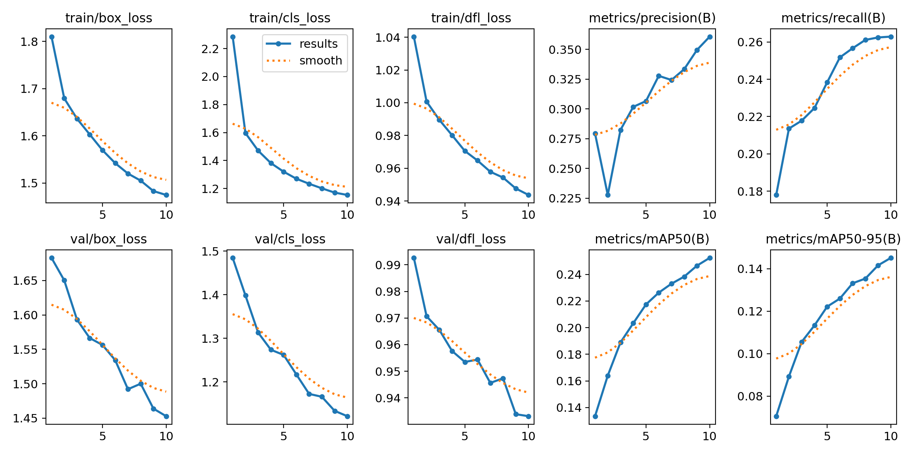
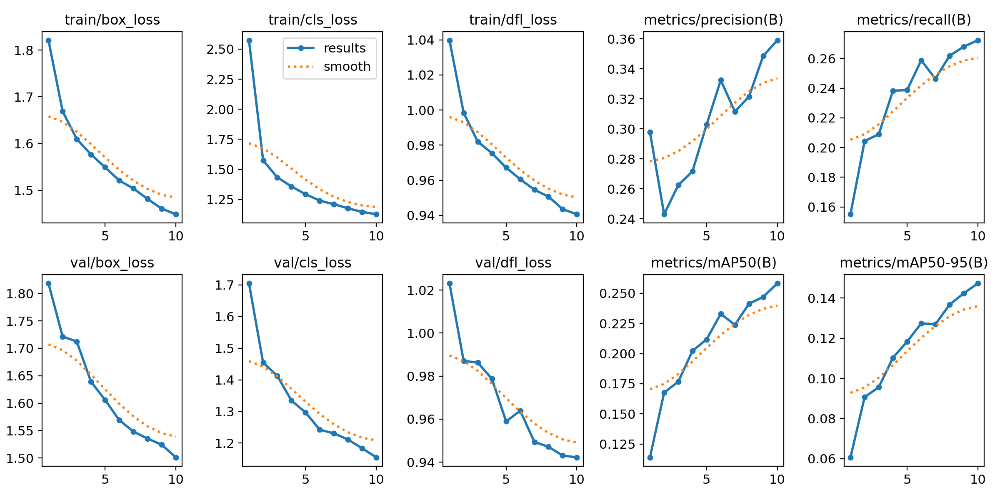

# VisDronDetectionTraining

## Train 1:

Utilized model.train() fuction with epoch = 10.

Result:

## Train 2:

Utilized model.train() fuction with epoch = 100.

Result:

## Train 3:
Epoch = 10

Augmentation = Mosaic from 1.0 to 0.5

Result:

## Train 4:
Epoch = 10

Augmentation = mixup from 0 to 0.5

Result:

## Train 5:
Epoch = 10

Augmentation = scale from 0.5 to 0.3

Result:

## Train 6:
Epoch = 10

Augmentation = scale from 0.5 to 0.0

Result:

## Train 7:
Epoch = 10

Batch size from 16 to 8

Result:

## Train 8:
Epoch = 10

Set batch to -1, automatic batch size depends on gpu: results in training with batch-size for 34.

Result:

## Problem with the dataset

One reason that can be predicted as why is the metrics comes out very bad is due the characteristic of the dataset.

When You look at the dataset, there are classes that are hard to distingish for the model

For example, (pedestrian and people), (bicycle, tricycle, awning-tricycle, motor), (car, van, bus, truck)

These specific classification of the object results in bad training.

This emphasize how crucial it is to create a dataset that can be easily classified, or classify into more broad class such as people, car, and cycle.